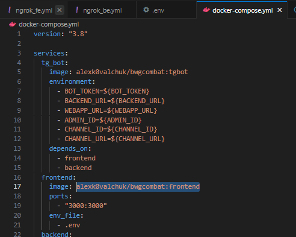

# 🇺🇸 (EN)
## ☁️Run cloud project
1. Create an .env file with the contents:
```
DEBUG=1
DJANGO_ALLOWED_HOSTS=*

ADMIN_USERNAME=admin
ADMIN_PASSWORD=admin
ADMIN_TG_ID=987654321

DB_NAME=bwgcombat_db
DB_HOST=db
DB_USER=root
DB_PASS=root
DB_PORT=5432

NGROK_AUTHTOKEN_FE=__token__
NGROK_AUTHTOKEN_BE=__token__

JWT_SIGNING_KEY=some_key

# TGBOT
BOT_TOKEN=__token__

BACKEND_URL=http://localhost:8000
WEBAPP_URL=https://localhost:3000

ADMIN_ID=111111111

CHANNEL_ID=-1111111
CHANNEL_URL=https://t.me/slug

TG_CHANNEL=https://t.me/justforcheckingone
```
2. Create an front.env file with the contents:
```
REACT_APP_API_BASE_URL=http://localhost:8000
REACT_APP_TELEGRAM_BOT_TOKEN=__token__
REACT_APP_GET_USER_INFO_ENDPOINT=/user/get_info/
REACT_APP_ADD_COINS_ENDPOINT=/user/add_coins/
REACT_APP_GET_USER_REFERRALS_ENDPOINT=/user/get_user_referrals/
REACT_APP_GET_USER_PARTNERS_ENDPOINT=/levels/partner_tasks/
REACT_APP_GET_USER_SOCIALS_ENDPOINT=/levels/social_tasks/
REACT_APP_EXECUTE_SWAP_ENDPOINT=/exchanger/execute_swap/
REACT_APP_EXECUTE_TRANSFER_ENDPOINT=/exchanger/execute_transfer/
REACT_APP_EXECUTE_TRANSACTIONS_ENDPOINT=/exchanger/all_transactions/

REACT_APP_SKIP_TELEGRAM_INIT=false
REACT_APP_TEST_USER_ID=123568
```
3. Ask Salo for 2 ngrok tokens and 2 ngrok domains (for BE and FE);
4. Open ngrok_be.yml (set hostname as be_ngrok_domain);
5. Open ngrok_fe.yml (set hostname as fe_ngrok_domain);
6. Open .env (set NGROK_AUTHTOKEN_BE, NGROK_AUTHTOKEN_FE, BACKEND_URL as https:// + be_ngrok_domain, WEBAPP_URL as https:// + fe_ngrok_domain)
7. Ask backend and frontend and tg-bot developers to push latest changes to cloud;
8. Open DockerDesktop;
9. Run the command 
```
docker-compose up
```

## 🏠Run local image
1. Create the image;
2. Find the image name in DockerDesktop;
3. Set the image name in docker-compose.yaml
if you are a frontend developer, then this line:\

4. Run the command
```
docker-compose up
```


# 🇺🇦 (UA)
## ☁️Запустіть хмарний проект
1. Створити файл .env з вмістом:
```
DEBUG=1
DJANGO_ALLOWED_HOSTS=*

ADMIN_USERNAME=admin
ADMIN_PASSWORD=admin
ADMIN_TG_ID=987654321

DB_NAME=bwgcombat_db
DB_HOST=db
DB_USER=root
DB_PASS=root
DB_PORT=5432

NGROK_AUTHTOKEN_FE=__token___
NGROK_AUTHTOKEN_BE=__token___

JWT_SIGNING_KEY=деякий_ключ

# TGBOT
BOT_TOKEN=__token__

BACKEND_URL=http://localhost:8000
WEBAPP_URL=https://localhost:3000

ADMIN_ID=111111111

CHANNEL_ID=-1111111
CHANNEL_URL=https://t.me/slug

TG_CHANNEL=https://t.me/justforcheckingone
```
2. Створіть файл front.env із вмістом:
```
REACT_APP_API_BASE_BASE_URL=http://localhost:8000
REACT_APP_TELEGRAM_BOT_TOKEN=__token__
REACT_APP_GET_USER_INFO_ENDPOINT=/user/get_info/
REACT_APP_ADD_COINS_ENDPOINT=/user/add_coins/
REACT_APP_GET_USER_REFERRALS_ENDPOINT=/user/get_user_referrals/
REACT_APP_GET_USER_PARTNERS_ENDPOINT=/levels/partner_tasks/
REACT_APP_GET_USER_SOCIALS_ENDPOINT=/levels/social_tasks/
REACT_APP_EXECUTE_SWAP_ENDPOINT=/exchanger/execute_swap/
REACT_APP_EXECUTE_TRANSFER_ENDPOINT=/exchanger/execute_transfer/
REACT_APP_EXECUTE_TRANSACTIONS_ENDPOINT=/exchanger/all_transactions/

REACT_APP_SKIP_TELEGRAM_INIT=false
REACT_APP_TEST_USER_ID=123568
```
3. Попросіть у Salo 2 токени ngrok і 2 домени ngrok (для BE і FE);
4. Відкрийте ngrok_be.yml (задайте hostname як be_ngrok_domain);
5. Відкрийте ngrok_fe.yml (задайте hostname як fe_ngrok_domain);
6. Відкрити .env (встановити значення змінних NGROK_AUTHTOKEN_BE, NGROK_AUTHTOKEN_FE, BACKEND_URL як https:// + be_ngrok_domain, WEBAPP_URL як https:// + fe_ngrok_domain)
7. Попросіть розробників бекенду, фронтенду та tg-ботів перенести останні зміни в хмару;
8. Відкрийте DockerDesktop;
9. Запустіть проект за допомогою команди 
```
docker-compose up
```

# 🏠Запустити локальний image
1. Створіть image;
2. Знайдіть назву image у DockerDesktop;
3. Змініть ім'я image в файлі docker-compose.yaml
якщо ви фронтенд-розробник, то цей рядок:\

4. Запустіть проект за допомогою команди 
```
docker-compose up
```